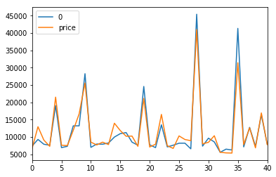

# Car-price-prediction

A simple regression model that predicts the price of a care based on features like company , Engine type , seats and many more features.
The algorithm used is the Decision Tree regressor

The blue line is the actual test set prediction.
The Orange Line is the prediction made by the model.

Very basic model just made for some data encoding practice, as the data that is available is categorical data.
Just wanted to implement Label Encoding on each of the categorical faetures.

It is Simple Machine Learning!
